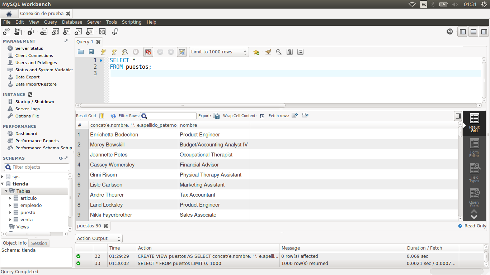
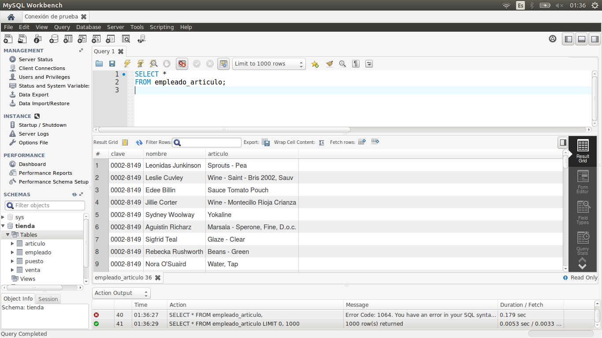

[`Introducción a Bases de Datos`](../../Readme.md) > [`Sesión 03`](../Readme.md) > `Reto 2`
	
## Reto 2: Definición de vistas

<div style="text-align: justify;">

### 1. Objetivos :dart:

- Definir vistas sobre algunas consultas.

### 2. Requisitos :clipboard:

1. MySQL Workbench instalado.

### 3. Desarrollo :rocket:

---

 

:warning: <ins>**IMPORTANTE**</ins>

_Para este reto necesitarás un identificador único. Tu identificador serán los últimos tres dígitos de tu número de celular. Por ejemplo, si tu número es: 5512345678 tu identificador debe ser 678. <ins>¡No lo olvides!</ins>_   

_**Te pedimos esto para que todos puedan realizar los ejemplos.**_


_Si no sigues las instruciones..._   

---

Usando la base de datos `tienda`, define las siguientes vistas que permitan obtener la siguiente información.

**AÑADE A TODOS LOS NOMBRES DE TUS VISTAS EL SUFIJO `_<tu identificador>`.** Por ejemplo `mi_vista_hermosa_123`.

- Obtener el puesto de un empleado.
- Saber qué artículos ha vendido cada empleado.
- Saber qué puesto ha tenido más ventas.
<<<<<<< HEAD
=======

<details><summary>Solución</summary>
<p>

- Obtener el puesto de un empleado.

   ```sql
   CREATE VIEW puestos_123 AS
   SELECT concat(e.nombre, ' ', e.apellido_paterno), p.nombre
   FROM empleado e
   JOIN puesto p
     ON e.id_puesto = p.id_puesto;
   ```
   
   ```sql
   SELECT *
   FROM puestos_123;
   ```
   
   

- Saber qué artículos ha vendido cada empleado.

   ```sql
   CREATE VIEW empleado_articulo_123 AS
   SELECT v.clave, concat(e.nombre, ' ', e.apellido_paterno) nombre, a.nombre articulo
   FROM venta v
   JOIN empleado e
     ON v.id_empleado = e.id_empleado
   JOIN articulo a
     ON v.id_articulo = a.id_articulo
   ORDER BY v.clave;
   ```
   
   ```sql
   SELECT *
   FROM  empleado_articulo_123;
   ```
   
   
   
- Saber qué puesto ha tenido más ventas.

   ```sql
   CREATE VIEW puesto_ventas_123 AS
   SELECT p.nombre, count(v.clave) total
   FROM venta v
   JOIN empleado e
     ON v.id_empleado = e.id_empleado
   JOIN puesto p
     ON e.id_puesto = p.id_puesto
   GROUP BY p.nombre;
   ```
   
   ```sql
   SELECT *
   FROM puesto_ventas_123
   ORDER BY total DESC
   LIMIT 1;
   ```
   
    

</p>
</details> 
>>>>>>> d9796a466ac3b1c288db4ea18738311570807aae

<br/>

[`Anterior`](../Ejemplo-02/Readme.md) | [`Siguiente`](../Readme.md#3-proyecto-hammer)

</div>
